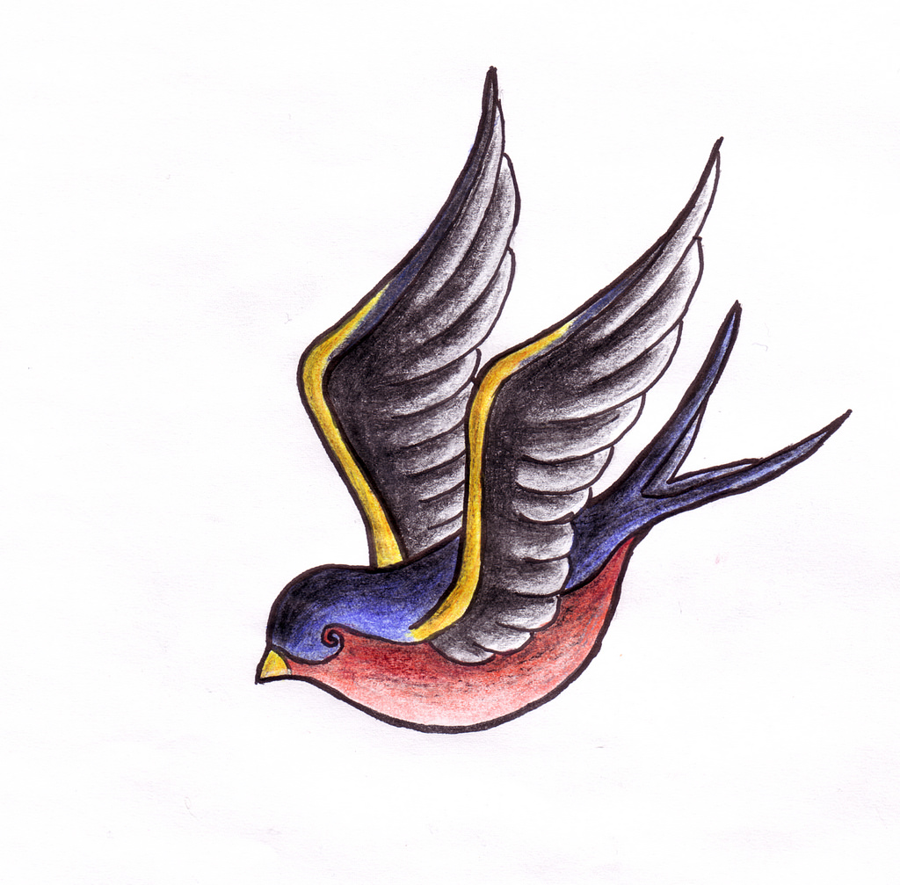

# Primer ejemplo completo: Pepita

*Pepita* es un ave que sabe volar y comer.

* Al volar gasta 1 joule de energía por cada kilómetro, más 10 joules para comenzar a volar.
* Por cada gramo que come gana 4 joules de energía

Tenés una batería de **tests** que aplican sobre pepita,

* para el estado inicial de pepita
* para los casos de éxito
* y para los casos con valores límite 
